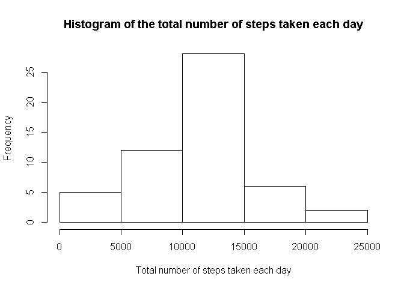
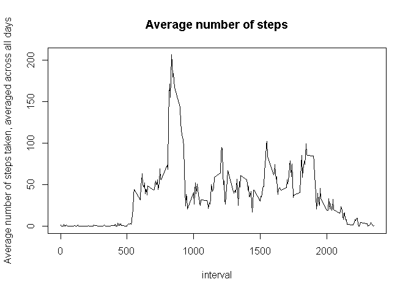
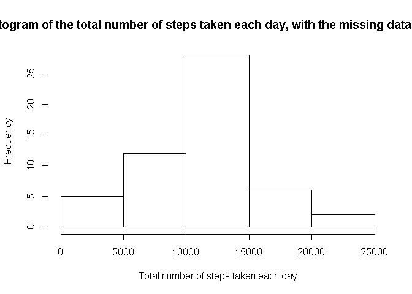
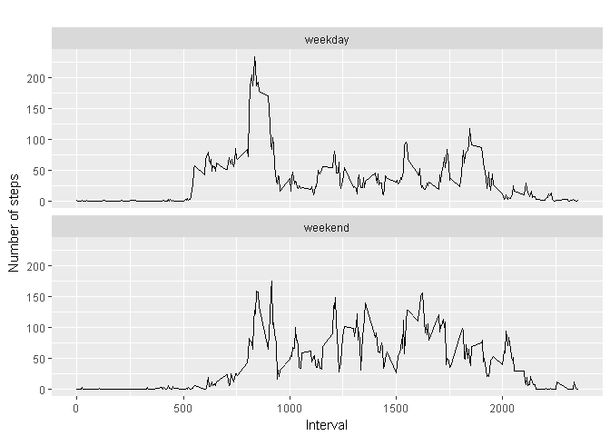

Reproducible Research: Peer Assessment 1
================

**necessary packages**
----------------------

``` r
knitr::opts_chunk$set(echo = TRUE)
library(knitr)
```

    ## Warning: package 'knitr' was built under R version 3.3.3

``` r
library(dplyr)
```

    ## Warning: package 'dplyr' was built under R version 3.3.3

    ## 
    ## Attaching package: 'dplyr'

    ## The following objects are masked from 'package:stats':
    ## 
    ##     filter, lag

    ## The following objects are masked from 'package:base':
    ## 
    ##     intersect, setdiff, setequal, union

``` r
library(ggplot2)
```

    ## Warning: package 'ggplot2' was built under R version 3.3.3

**Loading and preprocessing the data**
--------------------------------------

1 - Load data
-------------

``` r
activity<-read.csv('activity.csv')
```

2 - transform the data
----------------------

``` r
activity_1 <- activity[ with (activity, { !(is.na(steps)) } ), ]
```

**What is mean total number of steps taken per day?**
-----------------------------------------------------

1 - Calculate the total number of steps taken per day
-----------------------------------------------------

``` r
byday<-group_by(activity_1, date)
stepsbyday <- summarise(byday, sum = sum(steps))
stepsbyday
```

    ## # A tibble: 53 × 2
    ##          date   sum
    ##        <fctr> <int>
    ## 1  2012-10-02   126
    ## 2  2012-10-03 11352
    ## 3  2012-10-04 12116
    ## 4  2012-10-05 13294
    ## 5  2012-10-06 15420
    ## 6  2012-10-07 11015
    ## 7  2012-10-09 12811
    ## 8  2012-10-10  9900
    ## 9  2012-10-11 10304
    ## 10 2012-10-12 17382
    ## # ... with 43 more rows

2 - Make a histogram of the total number of steps taken each day
----------------------------------------------------------------

``` r
hist(stepsbyday$sum, main="Histogram of the total number of steps taken each day", xlab="Total number of steps taken each day")
```



3 - Calculate and report the mean and median of the total number of steps taken per day
---------------------------------------------------------------------------------------

``` r
mean(stepsbyday$sum)
```

    ## [1] 10766.19

``` r
median(stepsbyday$sum)
```

    ## [1] 10765

**Mean is 10766, median is 10765.**
-----------------------------------

**What is the average daily activity pattern?**
-----------------------------------------------

1 - Make a time series plot (i.e. type = "l") of the 5-minute interval (x-axis) and the average number of steps taken, averaged across all days (y-axis)
--------------------------------------------------------------------------------------------------------------------------------------------------------

``` r
stepsbyinterval <- aggregate(steps ~ interval, activity_1, mean)
plot(stepsbyinterval$interval, stepsbyinterval$steps, type='l',main="Average number of steps", xlab="interval", ylab="Average number of steps taken, averaged across all days")
```



2 - Which 5-minute interval, on average across all the days in the dataset, contains the maximum number of steps?
-----------------------------------------------------------------------------------------------------------------

``` r
stepsbyinterval[which.max(stepsbyinterval$steps), ]
```

    ##     interval    steps
    ## 104      835 206.1698

**The interval 835 has the maximum average number of steps (206.1698).**
------------------------------------------------------------------------

**Imputing missing values**
---------------------------

1 - Calculate and report the total number of missing values in the dataset
--------------------------------------------------------------------------

``` r
activity_NA <- sum(is.na(activity))
activity_NA
```

    ## [1] 2304

2 - Devise a strategy for filling in all of the missing values in the dataset.
------------------------------------------------------------------------------

``` r
filling_missing<- activity
for (i in 1:nrow(activity)) {
if (is.na(activity$steps[i])) {
intervalvalue <- activity$interval[i]
steps_value <- stepsbyinterval[
stepsbyinterval$interval == intervalvalue,]
activity$steps[i] <- steps_value$steps
}}
```

3 - Create a new dataset that is equal to the original dataset but with the missing data filled in.
---------------------------------------------------------------------------------------------------

``` r
inputs_by_day <- aggregate(steps ~ date, filling_missing, sum)
```

4 - Make a histogram of the total number of steps taken each day
----------------------------------------------------------------

``` r
hist(inputs_by_day$steps, main="Histogram of the total number of steps taken each day, with the missing data filled in", xlab="Total number of steps taken each day")
```



5 - and Calculate and report the mean and median total number of steps taken per day.
-------------------------------------------------------------------------------------

``` r
mean(inputs_by_day$steps)
```

    ## [1] 10766.19

``` r
median(inputs_by_day$steps)
```

    ## [1] 10765

6 - Do these values differ from the estimates from the first part of the assignment? What is the impact of imputing missing data on the estimates of the total daily number of steps?
-------------------------------------------------------------------------------------------------------------------------------------------------------------------------------------

``` r
mean(stepsbyday$sum)
```

    ## [1] 10766.19

``` r
median(stepsbyday$sum)
```

    ## [1] 10765

``` r
Impacta_in_mean<-(mean(inputs_by_day$steps)-mean(stepsbyday$sum))/mean(stepsbyday$sum)
Impacta_in_median<-(median(inputs_by_day$steps)-median(stepsbyday$sum))/median(stepsbyday$sum)
Impacta_in_mean
```

    ## [1] 0

``` r
Impacta_in_median
```

    ## [1] 0

**Mean values stays the same and therer is slight difference in meadian value.**
--------------------------------------------------------------------------------

**Are there differences in activity patterns between weekdays and weekends?**
-----------------------------------------------------------------------------

1 - Create a new factor variable in the dataset with two levels – “weekday” and “weekend” indicating whether a given date is a weekday or weekend day.
------------------------------------------------------------------------------------------------------------------------------------------------------

``` r
filling_missing['type_of_day'] <- weekdays(as.Date(filling_missing$date))
filling_missing$type_of_day[filling_missing$type_of_day  %in% c('sábado','domingo') ] <- "weekend"
filling_missing$type_of_day[filling_missing$type_of_day != "weekend"] <- "weekday"  

filling_missing$type_of_day <- as.factor(filling_missing$type_of_day)
filling_missing_steps_by_interval <- aggregate(steps ~ interval + type_of_day, filling_missing, mean)
```

2 - Make a panel plot containing a time series plot
---------------------------------------------------

``` r
qplot(interval, 
      steps, 
      data = filling_missing_steps_by_interval, 
      geom=c("line"),
      xlab = "Interval", 
      ylab = "Number of steps", 
      main = "") +
  facet_wrap(~ type_of_day, ncol = 1)
```


